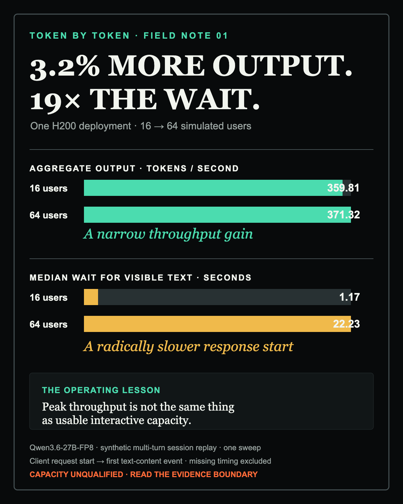

# Three Percent More Throughput. Nineteen Times the Wait.

*What RTX PRO 6000 and H200 session tests taught me about inference capacity—and why the evidence still stops short of a production sizing claim.*

In one H200 sweep, I increased the simulated user count from 16 to 64.

Aggregate output rose from **359.81 to 371.32 tokens per second**: a gain of just **3.2%**.

Median time to the first visible token rose from **1.17 to 22.23 seconds**: about **19× as long**.

If I had optimized only the throughput column, 64 users would have looked slightly better than 16. If I had been waiting inside one of those conversations, it would have felt dramatically worse.

The question was not simply, “Which GPU is faster?” It was:

> How do we find a useful operating point for multi-turn AI sessions without turning extra throughput into extra waiting—and what evidence is required before calling that point capacity?

This is the next step in **Token by Token — Inference Lab**, my hands-on study of LLM inference systems. The earlier warm-up compared serving configurations using fixed synthetic prompts. This time I moved closer to the shape of an agent session: ordered multi-turn conversations, tool schemas, recorded pauses, repeated sessions, two conversation slots per simulated user, and a load sweep from 2 to 100 users.

At the matched 16-user candidate point, the longer 15-minute soaks looked like this:

| 16 simulated users | RTX PRO 6000 deployment | H200 deployment |
|---|---:|---:|
| Aggregate successful output | 245.72 tok/s | 379.94 tok/s |
| Visible TTFT p95 | 8.22 s | 2.83 s |
| Valid / measured requests | 2,319 / 2,340 | 3,568 / 3,586 |
| Error rate | 0.90% | 0.50% |

The H200 deployment delivered more aggregate output and a much shorter visible first-token wait. The software environments differed, so these are deployment results—not an isolated GPU comparison. The evidence also does **not** establish “16 production users,” “128K prompts,” a universal hardware multiplier, or certified cached-session capacity.

## What changed after the warm-up

The [first Token by Token post](https://durgasuresh.substack.com/p/token-by-token-episode-0-warm-up) asked what we could learn from a vLLM-versus-SGLang comparison on an H100. It produced real measurements, but it also exposed problems with the question itself: input length and concurrency changed together, the longest cells delivered unequal amounts of output, and answer quality and stop reasons were unavailable.

This experiment did not try to turn that study into a trend line. Too many variables changed. Instead, it changed the benchmark design.

It also was **not** the controlled prefix-cache on/off experiment proposed at the end of Episode 0. Caching was enabled on both new deployments, but the required per-request cache evidence was not reported. That promised isolation remains future work.

| Dimension | Episode 0 warm-up | New session experiment |
|---|---|---|
| Main question | How did two serving configurations behave? | How did two documented deployments behave as conversational load increased? |
| Model | Qwen2.5-32B-Instruct, BF16 | Qwen3.6-27B-FP8 |
| Hardware | One H100 80GB per run | One RTX PRO 6000 or one H200 |
| Runtime comparison | vLLM 0.29.0 vs SGLang 0.5.20 | vLLM 0.20.1 on both deployments |
| Traffic | Deterministic exact-token prompts | Synthetic multi-turn session replay |
| Load shape | Fixed prompt/concurrency cells | 2, 4, 8, 16, 32, 64 and 100 simulated users |
| Conversation state | Independent prompts | Ordered history within two slots per user |
| Output maximum | 64 tokens in baseline; 128 in stress | 512 tokens |
| Main lesson | Delivered work and latency complicate runtime rankings | Throughput, waiting and missing evidence complicate user sizing |
| Principal limitation | No predeclared goodput SLO; unequal delivered work in long cells | No reported cached-token counts; provenance and server/client reconciliation remain unverified |

One historical number shows why the design needed to change. In the old 8,192-input-token, concurrency-32 stress cell, vLLM delivered 57.5 aggregate output tokens/s with a 47.9-second median first-token wait; SGLang delivered 43.7 tokens/s with an 88.3-second wait. But vLLM averaged 99.9 output tokens per request while SGLang averaged 128 against the same 128-token cap. That was measured behavior, not equal delivered work—and not a sound basis for crowning a runtime.

The new study keeps that lesson: a larger number is meaningful only when its denominator, workload and validity rules are explicit.

## What we measured

The workload contains **50 synthetic coding and issue-fix sessions with 914 turns**. Sessions range from 4 to 41 turns and represent several working styles: bug hunting, feature building, code review, refactoring, test writing, quick fixes and junior exploration.

These were recorded replays, not live coding agents. The benchmark replayed assistant and tool history but did not execute tools or grade whether a code change solved a real repository task. It can measure serving behavior; it cannot claim task success.

Each simulated user had **two independent conversation slots**. A slot allowed at most one outstanding request, preserved conversation order, and used a stable session cache scope until the next session began. At 16 users, the client could therefore have up to 32 requests in flight.

That does not mean 32 requests decoded simultaneously on the GPU. The server was configured for at most **eight scheduled sequences**. Excess work could wait in the serving queue.

Each sweep level used:

- 60 seconds of warm-up;
- 180 seconds of measured sends;
- a bounded drain for requests sent during the measurement window;
- a 512-token maximum output;
- four worker processes;
- recorded inter-turn gaps;
- session-scoped prefix caching;
- a fixed random seed.

After the seven-level sweeps, I ran a longer matched soak at 16 users: 15 minutes of measurement per deployment, plus bounded drain.

## Configuration matrix

The model revision, workload hashes and core serving limits were pinned. The environments were documented, but they were not identical enough to call this a hardware-only laboratory A/B.

| Setting | RTX PRO 6000 deployment | H200 deployment |
|---|---|---|
| GPU | NVIDIA RTX PRO 6000 Blackwell Server Edition | NVIDIA H200 |
| Memory noted in runbook | Approximately 97,887 MiB | Approximately 143,771 MiB |
| Model | Qwen/Qwen3.6-27B-FP8 | Same |
| Model revision | `e89b16ebf1988b3d6befa7de50abc2d76f26eb09` | Same |
| Serving engine | vLLM 0.20.1 | vLLM 0.20.1 |
| Tensor parallelism | 1 | 1 |
| Maximum model length | 131,072 tokens | 131,072 tokens |
| Maximum scheduled sequences | 8 | 8 |
| Batched-token budget | 16,384 | 16,384 |
| Prefix caching | Enabled; session-scoped workload | Enabled; session-scoped workload |
| Maximum output | 512 tokens | 512 tokens |
| Sampling | Temperature 1.0; top-p 0.95 | Same |
| GPU memory utilization flag | Committed config: 0.955; runbook says 0.95 | 0.95 |
| Runtime notes | Driver 595.91.07; Torch 2.11.0; CUDA 13.0 wheels; Python 3.12 | Driver 570.211.01; explicit CUDA 12.9 vLLM/Torch dependencies; Python 3.12 |
| Additional launch detail | Committed combo omits some flags listed on H200 | Language-model-only mode; Triton GDN prefill backend |
| Metrics map | Legacy map name remained in the committed combo | vLLM 0.20 metrics map |
| Client placement record | Runbook describes a Mac client; run config says `remote_pod` | Same unresolved discrepancy |

The same recorded sessions and prompt pack were used on both sides. The manifest image digest was also the same. Neither fact proves the installed environments or effective launch flags were identical.

That matters because the H200 setup required an explicit CUDA 12.9 stack after the default CUDA 13.0 path failed device initialization, and Triton was selected for GDN prefill to avoid a first-start FlashInfer dependency. These are deployment outcomes from this work—not universal recommendations for every H200 environment.

## The matched 16-user result

The cleanest comparison is the pair of 15-minute soaks at 16 simulated users.

Here, **aggregate successful output** means valid completion tokens divided by the measured send-cohort duration, including up to 120 seconds of bounded drain. The cohort includes requests sent during the measurement window and completed during drain. **Visible TTFT** runs from the client request start to the first text-content event; reasoning-only or tool-only fragments are not silently substituted for visible text. Percentiles exclude responses for which that event was not observed.

**Request decode rate** is client-derived: `(completion tokens − 1) / first-to-last output-event time`. Those events can include reasoning, text or tool fragments, so this is not a direct GPU decode measurement or necessarily the rate of visible prose. The p10 is the tenth percentile across applicable request rates, not a promise to each user.

| 16 users; up to 32 client requests in flight | RTX PRO 6000 | H200 |
|---|---:|---:|
| Aggregate successful output | **245.72 tok/s** | **379.94 tok/s** |
| Request decode p50 | 34.55 tok/s | 63.89 tok/s |
| Request decode p10 | 31.58 tok/s | 55.29 tok/s |
| Visible TTFT p50 | 4.89 s | 1.17 s |
| Visible TTFT p95 | **8.22 s** | **2.83 s** |
| End-to-end latency p50 | 6.09 s | 1.86 s |
| End-to-end latency p95 | 11.08 s | 4.62 s |
| Valid / measured requests | 2,319 / 2,340 | 3,568 / 3,586 |
| Valid responses with visible TTFT | 2,316 | 3,566 |
| Error rate | 0.90% | 0.50% |
| Valid completion tokens | 222,270 | 342,887 |
| Cohort duration including drain | 904.57 s | 902.47 s |

Within these two documented deployments, H200 delivered:

- **54.6% more aggregate successful output**;
- **84.9% higher median request decode rate**;
- **65.6% lower p95 visible first-token wait**.

Those are measured-deployment ratios, not general H200-versus-RTX performance factors.

The workload mix remained close but not byte-for-byte identical because closed-loop users progress at the speed of the system. Valid soak prompts had medians of 2,912 tokens on RTX and 2,894 on H200. Both peaked at 6,569 tokens. Median completions were 75 and 76 tokens.

That last point corrects an easy but serious headline error: **“128K” was the configured server context limit, not the observed prompt workload.** The prompts in these soaks ranged from about 1.2K to 6.6K tokens.

## The sweep: where throughput stopped buying a better experience

The sweeps show why one matched point is not enough.

### RTX PRO 6000

| Users | Client slot ceiling | Measured / valid | Output tok/s | Visible TTFT p50 / p95 | Error rate |
|---:|---:|---:|---:|---:|---:|
| 2 | 4 | 89 / 88 | 48.18 | 1.16 / 3.11 s | 1.12% |
| 4 | 8 | 149 / 148 | 76.92 | 1.21 / 3.43 s | 0.67% |
| 8 | 16 | 281 / 271 | 144.25 | 1.35 / 5.47 s | 3.56% |
| 16 | 32 | 460 / 456 | 233.50 | 5.19 / 8.01 s | 0.87% |
| 32 | 64 | 513 / 511 | 228.46 | 17.88 / 20.46 s | 0.39% |
| 64 | 128 | 360 / 359 | 115.47 | 66.80 / 75.39 s | 0.28% |
| 100 | 200 | 375 / 375 | 99.88 | 97.30 / 110.29 s | 0.00% |

On RTX, going from 16 to 32 users produced **2.2% less output**, while p95 visible TTFT became **2.56× longer**. At 100 users the counted error rate was zero, but p95 response start exceeded 110 seconds. Successful completion alone did not make the experience interactive.

### H200

| Users | Client slot ceiling | Measured / valid | Output tok/s | Visible TTFT p50 / p95 | Error rate |
|---:|---:|---:|---:|---:|---:|
| 2 | 4 | 102 / 101 | 54.15 | 0.81 / 1.75 s | 0.98% |
| 4 | 8 | 156 / 150 | 79.85 | 0.91 / 5.04 s | 3.85% |
| 8 | 16 | 360 / 358 | 187.07 | 0.91 / 1.92 s | 0.56% |
| 16 | 32 | 688 / 686 | 359.81 | 1.17 / 2.82 s | 0.29% |
| 32 | 64 | 627 / 521 | 258.45 | 8.88 / 45.18 s | 16.91% |
| 64 | 128 | 880 / 876 | 371.32 | 22.23 / 24.51 s | 0.45% |
| 100 | 200 | 701 / 510 | 183.90 | 52.04 / 107.44 s | 27.25% |

H200’s highest aggregate output appeared at 64 users, but it was only **3.2% above** the 16-user result while median visible TTFT was about **19× longer**. The 16-user point already achieved approximately **96.9%** of the sweep’s maximum aggregate output with a radically shorter wait.

That does not prove 16 is an exact knee or maximum. The sweep was run once, error rates were not monotonic, and there are no replicated confidence intervals. The exploratory minimum-valid-sample setting was reduced from the normal 100 to eight, although the actual valid row counts ranged from 88 to 876. Replayed requests are still not independent experimental replications. The result shows why capacity must be defined against an experience target rather than the highest throughput cell.

The H200 failures at 32 and 100 users also require care. The client observed 106 `RemoteProtocolError` failures out of 627 measured requests at 32 users, and 191 out of 701 at 100 users. That identifies a transport or protocol failure mode. It does not prove VRAM exhaustion, model failure or a hardware root cause.

## How the benchmark became harder to fool

The most important work happened before the comparison. Earlier measurement paths could let incomplete or malformed outputs look healthier than they were. The benchmark was changed so that success required stronger evidence.

| Change | Why it matters |
|---|---|
| Require terminal, finish and usage evidence | HTTP 200 or a partial stream no longer counts automatically as a valid completion |
| Keep reasoning, visible text and tool timing distinct | Visible TTFT is not fabricated from reasoning-only output |
| Assemble and validate streamed tool fragments | Invalid JSON tool arguments remain failures even when the server returned HTTP 200 |
| Preserve missing cache counts as null | Missing cache usage cannot silently become a zero or a hit-rate claim |
| Use a real streaming proxy and retain original requests | Recording does not buffer away streaming behavior or destroy replay input |
| Preserve ordered conversations in two independent slots | Turns from one conversation do not get mixed into another history |
| Select the corpus and prompt pack explicitly | A different workload cannot silently replace the intended one |
| Bound worker drain and retain request identities | The measured send cohort can be counted and cross-checked |
| Propagate command failures | A partial benchmark failure cannot masquerade as an all-stages success |

These rules caught failures a simplistic status-code counter would miss. Across the two soaks, the invalid requests included **25 RemoteProtocolError events** and **14 malformed tool-argument responses returned with HTTP 200**.

The retained raw-request crosscheck matched every one of the 16 aggregate sweep and soak rows to its recorded sample counts and reproduced aggregate output rates to within 0.000001 tokens/s. That strengthens the client-side aggregates. It does not repair evidence that was never captured.

## Why the report still says “capacity not established”

Both 16-user soaks numerically cleared a possible review line of 20 decode tokens/s at p10, p95 visible TTFT under 10 seconds, and error rate below 1%.

But a numerical pass is not the whole qualification contract.

Every level still records `capacity_qualified=false`. Every manifest records `unverified=true`, and hardware provenance is marked unverified. No measured request contains a reported cached-token count. Some otherwise valid responses also lack visible-text TTFT. The automated server/client consistency checks for request counts, token rates, timing differences, clock drift and request identity were not evaluated.

Prefix caching was enabled. **That does not prove the cache helped.** The result has no per-request cache-hit evidence, so “zero observed cache counts” means the instrumentation did not report them—not that the hit rate was zero.

Server telemetry from the deployment runbook supports a queueing hypothesis at the 16-user soak: both deployments reported a peak of eight running requests, while waiting requests peaked at 20 on RTX and seven on H200. Peak KV-cache utilization was reported as 5.81% and 3.31%, with no preemptions. But those series were not exported and reconciled as matched report artifacts, so I treat them as supporting runbook evidence rather than a completed causal diagnosis.

The honest conclusion is therefore narrower:

> Under this synthetic two-session-per-user replay, the tested 16-user configurations produced useful measured operating points. H200 delivered more output with materially less visible waiting. Cached-session capacity and production readiness remain unqualified.

## What this experiment actually cost

The latest handoff does not contain a reconciled RTX-versus-H200 rental-cost record or retained resource-cleanup evidence, so it cannot support a cost winner, per-user price or production-readiness claim.

| Activity | Retained cost evidence | Boundary |
|---|---:|---|
| New RTX PRO 6000 / H200 session experiment | Unavailable in the publication handoff | No matched hourly-rate or total-charge comparison should be inferred |
| Local analysis and publication drafting | $0 provider charge | No new GPU resource was created for this article |
| Earlier H100 Episode 0 runs | Approximately $2.19 combined CLI debit | Separate model, workload and experiment; not comparable to the new runs |
| Earlier RTX preparatory study | $4.1280 total session charge | Separate historical study including setup and troubleshooting |

Unit economics comes later. It will require the measured hourly cost, a workload’s token demand and active-session duty cycle, headroom, idle capacity, overhead and an accepted quality contract. Synthetic concurrent users are not monthly subscribers.

## The next controlled experiment

The next run should reduce uncertainty rather than simply add another GPU bar.

Next I will reconcile the effective environments and capture authoritative cache usage plus matched client/server telemetry, then repeat the 8-, 16- and 32-user points against a declared visible-response target. The planned cache on/off study will hold the session and output contracts fixed. A separate open-loop arrival-rate test will measure sustained arrivals, client schedule lag and overload behavior before any production sizing claim. Task-quality evaluation remains necessary before completed requests can become completed-work claims.

**Throughput tells us how much the service produced. Waiting tells us what the user experienced. Evidence quality tells us what we are allowed to promise.**

All three belong in the capacity decision.

Explore the full sweeps, previous-study comparison and configuration matrix in the **[interactive Token by Token dashboard](DASHBOARD LINK)**.

When you size an inference service, which response-start budget do you refuse to trade away for more aggregate throughput?

**Understand it. Measure it. One token at a time.**
