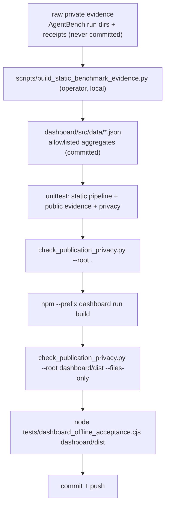
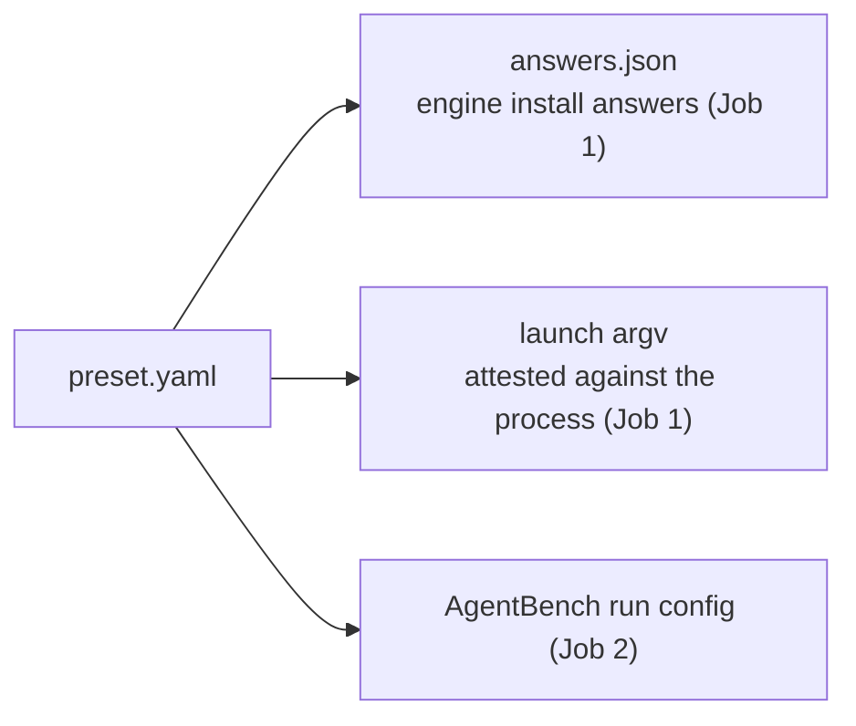
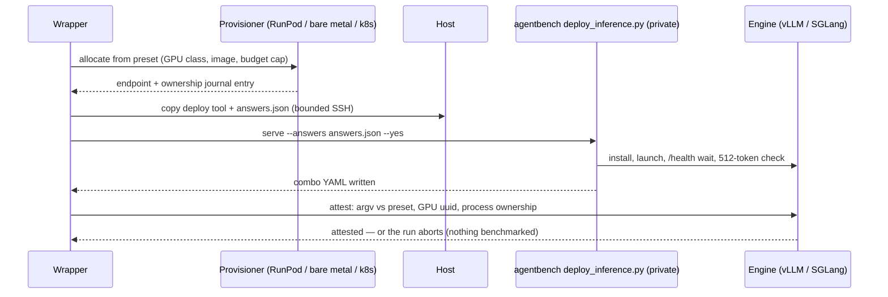
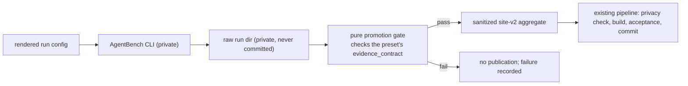

# Token by Token episode scripts — what, why, and how (plan)

Status: plan (not implemented). Date: 2026-10-09. Revised 2026-10-09:
rewritten as a step-by-step guide — plain what/why/how first, detail
after. Orchestration lives in the Token by Token operator wrapper;
AgentBench is the private measurement engine.
This document lives in the public repository by design; it references
the private AgentBench codebase only at the capability/CLI level and
contains no credentials, internal URLs, or private data.

---

## 1. What, why, and how

### 1.1 What is Token by Token

**Token by Token** (working name; tagline **Inference Lab**) is "a
hands-on series for learning how LLM inference works and choosing a
serving configuration that fits a use case" (README). An interactive
assistant needs a fast first token; a batch job needs useful work per
dollar; a long-context application needs room for its KV cache — "one
benchmark score cannot answer all three questions".

The series is 17 episodes (00–16), numbered under `episode-catalog.v2`
(effective 2026-10-02; the catalog lives in
`dashboard/src/data/episodes.json`, the canonical sequence in
`docs/roadmap.md`). Today:

- Episode 00 (warm-up) and Episode 01 (measure what matters) have
  recorded public evidence.
- Episodes 02–16 are planned; they are "proposals until an episode
  publishes evidence; they are not results or authorization to spend".

An **episode** is one experiment with five parts:

1. a **question** (e.g. "how many concurrent agent users can this
   deployment serve while decoding at at least the target rate?"),
2. a **workload** (what the requests look like — for Episode 1:
   realistic multi-turn agent sessions),
3. a **deployment** (model + engine (vLLM and/or SGLang) + GPU + launch
   flags),
4. an **evidence contract** (what must be measured, and which gate
   decides pass/fail — Episode 1's declared gate: decode p10 ≥ 20 tok/s,
   "90% of valid requests must decode at least that fast"),
5. a **sanitized public result** (what the public site may show).

### 1.2 What the scripts do

Every script in this repository does exactly one of three things:

| # | Job | Cost | Entry point (exists today) |
|---|-----|------|----------------------------|
| 1 | Verify a public evidence bundle (checksums, schema, privacy) | Free | `python3 scripts/verify_bundle.py data/public` |
| 2 | Rehearse the full measurement workflow on fixtures — no provider calls, no paid resources | Free | `python3 scripts/rehearse_workflow.py --output <dir>` |
| 3 | Run a real paid benchmark on rented GPU hardware and publish a sanitized result | Paid, gated | `src/runpod_benchmark/` operator toolchain (built for Episode 1) |

The spending boundary is explicit in the README: "Cloning or running
this repository authorizes no provider call, purchase, resource
creation, publication, or redistribution." A paid run "needs an
immutable image digest, maximum charge, exact approval, permanent
deletion of every created resource, and provider-side verification of
deletion".

So who can run what?

- **A student (free, no GPU, no accounts):** jobs 1–2, the local
  dashboard, and `scripts/quick-test` — section 2.2 walks through all
  of it, copy-paste.
- **The operator (paid, with the owner's exact approval):** job 3, via
  the Episode 1 toolchain.
- **What this plan adds:** a parameterized wrapper that makes job 3
  work for episodes 2–16 the same way it worked for Episode 1 — one
  preset file per episode, two wrapper jobs (section 3).

### 1.3 Why it is built this way

Three design rules shape every script here; the plan follows them too.

1. **Local-first.** "You can inspect retained public evidence, rehearse
   the measurement workflow, and run the dashboard without renting a
   GPU" (README). The public site is fully static: it "does not contact
   VictoriaMetrics, Grafana, a provider, or the private source
   repository" (Episode 1 README).
2. **Fail-closed spending.** Nothing creates a paid resource without a
   fully bound plan (exact image digest, maximum charge, endpoints) and
   the owner's exact approval phrase. Even the free rehearsal compiles
   a "deliberately nonapprovable zero-cost plan".
3. **Fail-closed publication.** Raw data never leaves the private side.
   Only allowlisted aggregates are published, through pure functions
   plus a deterministic privacy checker; the public repository contains
   no secrets, endpoints, engine versions, or serving profiles.

### 1.4 How it all fits (big picture)

```mermaid
flowchart LR
    subgraph pub["Token by Token (this public repo)"]
        P["episodes/NN-slug/preset.yaml<br/>question + workload + gates"]
        W["operator wrapper<br/>Job 1: deploy + configure<br/>Job 2: benchmark + publish"]
        S["public site (static React + sanitized JSON)"]
    end
    subgraph paid["paid environment (per episode, then deleted)"]
        E["GPU VM / bare metal / container<br/>vLLM and/or SGLang at the episode's exact config"]
    end
    subgraph priv["AgentBench (private repo)"]
        D["tools/deploy_inference.py<br/>engine install + configuration"]
        M["measurement engine: sweeps, workloads, gates, run dirs"]
    end
    P --> W
    W -->|Job 1: provision, install, launch, attest| E
    D --> E
    W -->|Job 2: rendered run config| M
    E -->|endpoint under test| M
    M -->|raw run dir (private)| W
    W -->|sanitized site-v2 aggregate| S
```

A complete episode run, in plain language:

1. **Read the preset** — `episodes/01-.../preset.yaml` declares the
   question, model, engine(s), GPU, load levels, and gate.
2. **Plan (dry run)** — the wrapper prints the exact engine install
   answers, exact launch command line, and exact benchmark run config.
   Nothing is created; the printout is the approval artifact.
3. **Deploy (Job 1)** — provision one of three environments, install and
   configure the engine with the preset parameters, launch it, and
   **attest** that the running process matches the preset exactly. Any
   mismatch aborts the run before benchmarking.
4. **Benchmark (Job 2a)** — the wrapper hands the rendered run config to
   the private AgentBench CLI; it sweeps load levels against the
   attested endpoint and writes a raw run directory (private).
5. **Promote (Job 2b)** — a pure promotion gate (no I/O, recomputes
   digests) checks the preset's evidence contract against the run dir
   and emits the sanitized site-v2 aggregate on pass.
6. **Publish** — the existing pipeline takes over: privacy check,
   static build, browser acceptance, commit (section 2.3).

### 1.5 How to read this document

- **exists today** — the file or command is in this repository now;
  quoted code is copied verbatim from the file named.
- **[planned]** — part of this plan, not written yet; planned code
  blocks are marked `# PLANNED`.
- **private** — lives in AgentBench; referenced at capability/CLI level
  only.

---

## 2. What is already in the repository (all verified)

### 2.1 Directory map

```text
token-by-token/
├── README.md                          # quickstart, spending boundary, publication lifecycle
├── episodes/                          # one folder per episode
│   ├── 00-warm-up/README.md
│   ├── 01-measure-what-matters/README.md
│   └── TEMPLATE.md
├── scripts/                           # user + operator entry points (35 files)
│   ├── quick-test                     # free local demo/serve/request/compare/episode
│   ├── episode1_playground.py         # local bridge + dashboard (Docker entrypoint)
│   ├── verify_bundle.py               # verify a public evidence bundle
│   ├── rehearse_workflow.py           # zero-cost full-workflow rehearsal
│   ├── compile_plan_cli.py            # manifest + live inputs -> bound plan (0 provider calls)
│   ├── build_static_benchmark_evidence.py  # private run dirs -> public aggregate (operator)
│   ├── check_publication_privacy.py   # deterministic publication privacy gate
│   ├── execute_episode1.py            # approved Episode 1 execution (operator)
│   └── ...
├── src/runpod_benchmark/              # hardened Episode 1 toolchain (~35 modules)
│   ├── runpod_v2.py                   # RunPod provision/destroy + ownership journal
│   ├── episode1_remote.py             # bounded SSH executor
│   ├── episode1_runtime_control.py    # runtime control + GPU attestation
│   ├── episode1_promotion.py          # pure promotion (recomputes digests)
│   ├── benchmark_standard.py          # benchmark + quality contract types
│   └── ... (guards, watchdogs, billing, telemetry)
├── dashboard/                         # React site (Vite, strict TS)
│   ├── src/data/episodes.json         # episode-catalog.v2 (the 17-episode catalog)
│   ├── src/data/site-v2/              # allowlisted public projections
│   └── package.json                   # build / check / dev
├── data/public/                       # committed sanitized evidence snapshot
├── fixtures/episode1/                 # deterministic public fixtures
├── docs/                              # roadmap, runpod-setup, episode-1-preparation/
├── tests/                             # python unit tests + node acceptance tests
├── Dockerfile                         # console image (node build -> python slim)
├── compose.yaml                       # local 3-service stack (loopback only)
└── deploy/                            # VictoriaMetrics + Grafana local configs
```

### 2.2 The free loop you can run right now

Prerequisites (README): Python 3.12 or newer and Node.js 22.12 or
newer in the Node 22.x line; npm comes with Node.js.

```bash
git clone https://github.com/KVSDURGASURESH/token-by-token.git
cd token-by-token

# job 1: verify the committed evidence
python3 scripts/verify_bundle.py data/public

# job 2: zero-cost rehearsal of the full workflow
REHEARSAL_DIR="$(mktemp -d "${TMPDIR:-/tmp}/inference-lab-episode-0.XXXXXX")"
printf '%s\n' "$REHEARSAL_DIR"
python3 scripts/rehearse_workflow.py --output "$REHEARSAL_DIR"
python3 scripts/verify_bundle.py "$REHEARSAL_DIR"

# unit tests
python3 -m pip install '.[test]'
python3 -m unittest discover -s tests -p 'test_*.py' -v
```

Expected output (README, exact):

- both `verify_bundle.py` commands report JSON containing `"ok":true`;
- the rehearsal prints a one-line JSON result containing
  `"classification":"fixture_zero_cost"`, `"paid_resources_created":0`,
  and `"provider_attempts":0`;
- the tests finish with `OK`.

What the rehearsal actually does: it "reuses sanitized aggregates to
exercise the workflow, makes no provider call, creates no paid
resource, records no new measurement, and compiles a deliberately
nonapprovable zero-cost plan" (README). That last part is the same
plan-approval concept the wrapper generalizes in section 3.

Then the local dashboard:

```bash
npm --prefix dashboard ci
npm --prefix dashboard run check
npm --prefix dashboard run build
npm --prefix dashboard run dev -- --host 127.0.0.1 --port 5173 --strictPort
```

Open `http://127.0.0.1:5173/` (the episode index is the default home).
The zero-setup alternative:

```bash
scripts/quick-test demo
```

What `quick-test` offers (from the script itself, exists today):

```text
Commands:
  demo       Build when needed, then launch the dashboard with local demo lanes
  serve      Build when needed, then launch the dashboard for configured endpoints
  request    Run one CLI request through an already-running bridge
  compare    Run a CLI comparison through an already-running bridge
  episode    Run one Episode 1-16 endpoint rehearsal through the bridge
  setup      Install pinned dashboard dependencies and build the dashboard
  help       Show this message
```

Examples (from the script's own usage text):

```bash
scripts/quick-test request --profile demo-fast --prompt 'Explain TTFT.'
scripts/quick-test episode --episode 3 --profile demo-fast --profile demo-steady
```

> Quick test results are interactive diagnostics, not the benchmark
> evidence (README). This free loop is where a student "executes the
> scripts plan": it exercises the same verify → plan → measure →
> publish shape as a paid episode, on fixtures.

### 2.3 The publication pipeline (exists today)



Exact commands (README, "Static publication lifecycle"):

```bash
python3 -m unittest tests.test_static_evidence_pipeline tests.test_episode1_public_evidence tests.test_publication_privacy
python3 scripts/check_publication_privacy.py --root .
npm --prefix dashboard ci
npm --prefix dashboard run check
npm --prefix dashboard run build
python3 scripts/check_publication_privacy.py --root dashboard/dist --files-only
node tests/dashboard_offline_acceptance.cjs dashboard/dist
```

Key facts, all from the README (exact):

- "The metrics import is a one-time construction step for each approved
  evidence release. Local VictoriaMetrics and Grafana are used to
  validate the source windows and produce the allowlisted aggregate
  document; they are not website dependencies."
- The site-v2 projections "intentionally omit serving profiles, launch
  settings, private endpoints, and engine versions".
- "Never commit the private inputs or receipts."

The privacy checker's own description (its docstring, exact):
"Deterministic, value-free privacy checks for a publication checkout.
This is a narrow heuristic gate, not a proof that content is free of
secrets. It reports only a location and finding category; matched text
is never emitted."

### 2.4 The Episode 1 operator toolchain (exists today)

The paid path already exists, built for Episode 1 in
`src/runpod_benchmark/` (operator docs: `docs/runpod-setup.md`,
`docs/live-run.md`, `docs/episode-1-preparation/`). The pieces this
plan reuses:

| Piece | Modules | What they do |
|---|---|---|
| Provisioning | `runpod_v2.py`, `episode1_runpod_adapter.py`, `bounded_runpod_transport.py` | RunPod create/delete behind an ownership journal; deletion authority only for resources that journal created |
| SSH | `episode1_remote.py` | bounded executor: argv vectors, strict POSIX quoting, strict file modes; no resource creation, no shell expansion, no environment overrides |
| Runtime control | `episode1_runtime_control.py`, `gpu_process_ownership.py`, `canonical_launch.py` | closed JSON schemas; GPU attestation (uuid, driver, boot id, CUDA, memory); clock sync; GPU process ownership |
| Contracts | `benchmark_standard.py` | dataclasses for the benchmark contract, quality contract, and combined result |
| Promotion | `episode1_promotion.py` | pure functions; `seal()` recomputes `plan_sha256` and `bundle_digest`, trusts no producer booleans |
| Safety | `episode1_guard.py`, `episode1_watchdog.py`, `pod_supervisor.py`, `local_watchdog.py` | kill switch, budget guard, supervision |
| Billing | `episode1_orchestrator.py`, `episode1_production.py` | billing/ownership capture, cleanup observation |

The style every planned piece follows — `seal()` from
`src/runpod_benchmark/episode1_promotion.py` (exact):

```python
def seal(plan: dict[str, object], evidence: dict[str, object]) -> dict[str, object]:
    sealed = json.loads(json.dumps(evidence, sort_keys=True))
    sealed["inputs"] = {"plan_sha256": str(plan.get("plan_sha256", ""))}
    sealed["plan_sha256"] = plan_digest(plan)
    sealed["bundle_digest"] = json_digest(sealed)
    return sealed
```

Pure. Closed inputs. Digests recomputed, never trusted. Every planned
piece in this document follows this style.

---

## 3. What this plan adds: one preset per episode, two wrapper jobs

### 3.1 The unit of work: an episode preset [planned]

Host: `episodes/NN-<slug>/preset.yaml` in this repository — public,
committed, reviewed in the same PR as the episode content. One file
per episode, next to its README.

Why here and not in AgentBench:

- the episode **question and gates are public teaching content** —
  they belong next to the episode README, not in a private repo;
- AgentBench is a general measurement engine; it should not host
  per-project episode metadata;
- AgentBench already accepts everything it needs through
  `--run-config` / `--workload` / `--profile` — the wrapper **renders
  the preset into those**. No new AgentBench CLI is needed.

Example — Episode 01:

```yaml
# episodes/01-measure-what-matters/preset.yaml   # PLANNED
episode:
  id: 01
  slug: measure-what-matters
  catalog: episode-catalog.v2
  question: >
    How many concurrent agent users can this deployment serve while
    decoding at at least the target rate?
  evidence_contract:
    performance:
      gate: {metric: decode_p10_tps, op: ">=", value: 20}
      reported_not_gated: [client_ttft_ms_p50, client_ttft_ms_p95]
    quality: null
  outputs: [verdict, levels, soak, metrics]
  publication: token-by-token

run_name: episode-01-capacity
mode: sweep
combo: configs/combos/<combo>.yaml
workload: configs/workloads/<workload>.yaml
levels: [1, 2, 4, 8, 16, 32, 48, 64, 96, 128]
warmup_s: 30
measure_s: 120
workers: 16
repeats_at_knee: 2
bisect_steps: 2
target_tps: 20
slots_per_user: 2
seed: 42
```

Field by field, in plain language:

| Field | What it says | Why it exists |
|---|---|---|
| `episode.id` / `slug` / `catalog` | which episode, under which numbering | provenance; the catalog was renumbered once (v1→v2) and stored results keep their recorded number |
| `question` | the one question this episode answers | an episode is an experiment, not a run |
| `evidence_contract.performance.gate` | the pass/fail threshold — Episode 1: decode p10 ≥ 20 tok/s | the promotion gate is checked against this, not against a judgment call |
| `reported_not_gated` | published but never pass/fail (TTFT for Episode 1) | keeps "reported evidence" separate from "capacity gate" (Episode 1's own wording) |
| `evidence_contract.quality` | quality gate, if the episode needs one (`null` here) | "A faster configuration that fails the quality gate is not a winner" (roadmap) |
| `outputs` | what must exist in the run dir before promotion | fail closed on missing evidence |
| `publication` | which pipeline consumes the result | binds the run to the sanitization pipeline |
| `run_name` / `mode` / `combo` / `workload` | how AgentBench runs it | standard AgentBench run-config fields, unchanged |
| `levels` / `warmup_s` / `measure_s` / `workers` | load-sweep shape and timing | the same knobs the Episode 1 plan used |
| `target_tps` / `slots_per_user` | per-user decode target, context slots per user | defines what a "concurrent agent user" is |
| `seed` | RNG seed | reproducibility; required for matrix episodes |

How the preset is consumed — one file, three renderings:



### 3.2 Job 1 — deploy and configure [planned]

Goal in one sentence: *bring up exactly the environment the preset
declares, and prove it, before anything is benchmarked.*

1. **Provision** one of three adapters, all behind the same allocation
   interface:

   | Environment | How | Status |
   |---|---|---|
   | RunPod VM | the existing adapter (`runpod_v2.py` + runpod adapter) | exists; allocation facts generalized per episode |
   | Bare metal | `episode1_remote.py` is host-agnostic; the operator preflight (`docs/episode-1-preparation/operator-preflight.md`) applies unchanged | exists as an executor |
   | Container / k8s | drive `helm`/`kubectl` against the deployment plan's chart | [planned] — see `2026-10-09-docker-k8s-helm-deployment-plan.md` section 4.8 |

2. **Install and configure the engine** with the preset's parameters.
   The wrapper renders the preset into the deploy tool's
   non-interactive `answers.json` (model + revision, engine + version,
   GPU class, TP size, KV dtype, memory fraction, launch flags) and
   runs the private AgentBench `tools/deploy_inference.py`
   (`serve --answers <file> --yes`) — a self-contained stdlib file
   copied to the host. That tool does the hard parts: `uv` venvs,
   torch/CUDA repair with a compiled probe, version-agnostic flag
   resolution against the engine's own `--help`, model-aware planning,
   launch, `/health` wait, a real 512-token generation check, the GPU
   exporter — and it writes the AgentBench **combo YAML** that Job 2
   consumes.
   - Prebuilt-image episodes (e.g. 14, packaging) skip the in-place
     install and launch from the digest-pinned image; the launch argv
     is still rendered from the preset.
   - The install logic deliberately stays private in AgentBench; this
     repository does not duplicate engine plumbing.

3. **Attest** the running engine. The existing runtime-control layer
   starts a fixed helper over bounded SSH, waits for `/health`, and
   verifies the running process. This is the one real gap in today's
   code: the expected launch command line is frozen to Episode 1's two
   runtimes (`src/runpod_benchmark/episode1_runtime_control.py`,
   exact):

   ```python
   def _expected_argv(engine: str, model: str) -> tuple[str, ...]:
       model_arg = f"--model {model}" if engine == "vllm" else f"--model-path {model}"
       if engine == "vllm":
           return (
               "vllm",
               "serve",
               model,
               "--served-model-name",
               "qwen32b",
               "--dtype",
               "auto",
               "--max-num-seqs",
               "16",
               "--max-model-len",
               "32768",
               "--gpu-memory-utilization",
               "0.8",
               "--port",
               "8000",
               "--enable-metrics",
           )
       # the SGLang twin, same style: python3 -m sglang.launch_server ...
   ```

   The plan: keep the strictness, but render the expected argv
   **from the preset** (any engine, any version, any flags). A
   mismatch between the preset-declared parameters and the observed
   process fails the run before any benchmarking. All existing
   hardening stays: GPU process ownership, watchdogs, kill switch,
   budget guard.

Job 1, end to end:



### 3.3 Job 2 — benchmark and publish [planned]

1. The wrapper renders the preset into an AgentBench **run config**
   (mode, combo, workload, profile, levels, targets, gates, seed) and
   invokes the private AgentBench CLI from the operator workstation
   (or the host), pointed at the attested endpoint through the
   existing tunnel code.
2. AgentBench produces the **run directory** (raw, private): verdict,
   levels.csv, PP/TG, agent sessions, soak, metrics export.
3. A new **pure promotion gate** — sibling of
   `episode1_promotion.py`, same style as `seal()` in section 2.4 (no
   I/O, recomputes digests, trusts no producer booleans) — consumes
   the run directory, checks the preset's `evidence_contract`, and
   emits the sanitized site-v2 aggregate.
4. The existing publication pipeline takes over unchanged
   (section 2.3): privacy check, build, dist privacy check, browser
   acceptance, commit.



### 3.4 How you invoke it [planned]

```text
python scripts/run_episode.py --preset episodes/01-.../preset.yaml plan
python scripts/run_episode.py --preset ... --env runpod deploy   # job 1
python scripts/run_episode.py --preset ... bench                 # job 2
python scripts/run_episode.py --preset ... all                   # both
```

- `plan` (dry run, the default) prints the exact `answers.json`,
  launch argv, and AgentBench run config that would be used — the
  approval artifact before any paid resource is created. Same pattern
  as `scripts/compile_plan_cli.py` today, which emits `plan_sha256`
  and an `approval_phrase` with `"provider_calls": 0`.
- The entry point follows the existing `scripts/` convention; library
  code lands in `src/runpod_benchmark/`.
- `deploy` never runs without the exact approval flow documented in
  `docs/runpod-setup.md` / `docs/live-run.md`.

---

## 4. Episode preset schema — reference and rules [planned]

### 4.1 Matrix episodes (multi-arm comparisons: 02, 05, 07, ...)

Multi-arm episodes use a `combos:` list plus a `matrix:` block:

```yaml
combos:
  - configs/combos/model-gpu-vllm.yaml
  - configs/combos/model-gpu-sglang.yaml
matrix:
  counterbalance: true               # order randomized per campaign, recorded
  run_per_combo: full                # or: calibrate-only, pptg-only
```

`counterbalance` implements the roadmap rule "randomize or
counterbalance execution order" for cross-engine comparisons.

### 4.2 What AgentBench already expresses (no new engine features)

| Concept | Run-config field | Workload knob |
|---|---|---|
| mode | `mode`: sweep / soak / pptg / mixed / agent | — |
| load shape | `levels`, `workers`, `slots_per_user` | arrival process, session turns, prefix reuse |
| targets | `target_tps` + the preset's `evidence_contract` gates | — |
| timing | `warmup_s`, `measure_s`, `duration` | — |
| reproducibility | `seed`, `repeats_at_knee`, `bisect_steps` | counterbalance (above) |

The preset adds nothing the engine cannot already run — it is a
rendering problem, which is why no AgentBench changes are planned for
phases 1–3.

### 4.3 Validation rules

Enforced by the wrapper's preset validator (public code, pure, run
before any resource is created); AgentBench re-validates the rendered
run config:

- `episode.id` 0–16; `slug` matches the `episodes.json` catalog entry.
- `publication: token-by-token` requires
  `evidence_contract.performance`, and a quality gate when the episode
  contract demands one.
- `combos:` + `matrix.counterbalance` require `seed`.
- `duration` is required for 15/16 (saturation, capstone) presets.
- The preset itself is public, so nothing private may be needed to
  render it; any render target that would land in a public file must
  be allowlisted.

## 5. Mapping results back to Token by Token

What may be published, and what enforces it:

| May be published | Source of truth | Enforced by |
|---|---|---|
| sanitized site-v2 aggregate: verdict, per-level aggregates (decode p10, TTFT percentiles, throughput, goodput), soak summary, cost summary | the private AgentBench run dir | the pure promotion gate (recomputes digests) |
| episode question, gates, workload shape | `preset.yaml` | reviewed in PR |
| static site pages | `dashboard/src/data/site-v2/` | `check_publication_privacy.py` + acceptance tests |
| everything else (endpoints, engine versions, serving profiles, launch settings, raw traces) | — | never; the privacy checker and projection schema reject it |

"Never commit the private inputs or receipts" (README). Private inputs
never enter public git history; the site projections "intentionally
omit serving profiles, launch settings, private endpoints, and engine
versions".

## 6. Per-episode assessment

Fit legend: **full** = the AgentBench engine runs it as-is today;
**partial** = needs the new workload/gate/environment piece listed;
**none** = outside the inference measurement engine's scope.

| Ep | Experiment (catalog) | Fit | Notes |
|---|---|---|---|
| 00 | Warm-up — follow a request through prefill, decode, KV cache; explore the recorded vLLM/SGLang runs | full | published; the fixture + rehearsal path already exercises it |
| 01 | Measure what matters — SGLang vs vLLM on one H200 at matched loads | full | sweep + capacity verdict + decode p10 gate; the wrapper's anchor episode |
| 02 | Equal-work runtime baseline — HF/PyTorch, vLLM, SGLang, same contract | partial | needs a non-engine (HF/PyTorch) control arm in combo/workload; counterbalance via `matrix:` |
| 03 | Prefix reuse — exact shared-prefix ratios, cold vs warm cache | partial | workload needs a prefix-ratio knob; cache telemetry from the run-dir metrics export |
| 04 | Batching, scheduling, mixed traffic — chunked prefill, long/short mixes | partial | mixed-traffic workload mode; scheduler counters from the metrics export |
| 05 | Attention kernels and precision — verified backends; weight/KV precision | partial | one combo per backend/precision; dispatch verification is a Job 1 attestation concern |
| 06 | Speculative decoding and structured outputs | partial | proposal-length sweep = `levels`; schema validity vs semantic correctness = quality contract |
| 07 | Parallelism within one node — DP vs TP (+PP, EP) under one GPU budget | partial | one combo per layout; per-rank memory from GPU telemetry |
| 08 | Parallelism across nodes — layouts on a documented topology | partial | needs a multi-node provisioning adapter (Job 1 environment); engine side unchanged |
| 09 | Prefill/decode disaggregation and cache-aware routing | partial | two pool endpoints (combos); routing policy is a workload knob |
| 10 | Slurm and Kubernetes orchestration — platform choices, separate from engines | partial | the k8s adapter (Job 1) is the point; measurement reuses sweep/soak |
| 11 | Model internals: weights to optimization | none | training/model-track companion study; out of scope |
| 12 | LoRA and QLoRA with held-out evaluation | none | training track; only its final evaluation is inference-shaped |
| 13 | SYSTEM 1 and LLMs on labeled decision tasks | none (workload) | needs a decision-task workload + quality contract; the inference run itself is covered |
| 14 | Packaging, accelerator preflight, memory containment | full | Job 1 is the experiment: prebuilt image, launch attestation, memory guard |
| 15 | Saturation, SLO and cost — concurrency + offered-rate sweep | full | sweep/soak + offered-rate mode; cost from billing capture |
| 16 | Release gates, recovery and capstone synthesis | partial | gate composition + recovery drill; needs a "release candidate" preset shape |

Gap episodes and what they need: 13 (a decision-task workload + labeled
set), 15/16 (offered-rate + soak + release-candidate shapes), 11/12
(not inference — no wrapper work).

## 7. Implementation phases

### Phase 1 — presets, validator, `plan` (this public repository; a student can do it)

1. `episodes/00-warm-up/preset.yaml` and
   `episodes/01-measure-what-matters/preset.yaml` (section 3.1).
2. A preset validator — pure, closed schema — in
   `src/runpod_benchmark/`.
3. `scripts/run_episode.py plan` — the dry-run renderer
   (answers.json + launch argv + run config).

Verify (all free, all in this repository):

```bash
python3 -m unittest discover -s tests -p 'test_*.py' -v
python3 scripts/run_episode.py --preset episodes/01-measure-what-matters/preset.yaml plan
python3 scripts/check_publication_privacy.py --root .
```

Exit criteria: the `plan` output is a diff-reviewed artifact; the
validator rejects a mutated preset (negative unit test); the privacy
check is clean.

### Phase 2 — parameterized Job 1 (operator; one paid run to verify)

Preset-rendered argv in `episode1_runtime_control.py` (replacing the
frozen `_expected_argv`), the `answers.json` renderer, attestation
against the rendered argv. Verify on the existing Episode 1 RunPod
path with the full approval flow (`docs/runpod-setup.md`).

### Phase 3 — Job 2 (operator; fixtures first, then one paid run)

Run-config renderer, AgentBench invocation, the pure promotion gate,
the site-v2 projection, and the existing pipeline. Verify on fixtures
first (the rehearsal pattern, section 2.2), then one paid Episode 1
re-run compared against the recorded baseline (drift evidence).

### Phase 4 — k8s adapter + matrix

The Helm adapter (deployment plan section 4.8), `combos:` +
counterbalance, matrix gate.

### Phase 5 — gap episodes

The 13 decision-task workload + quality contract; the 15/16
offered-rate + soak + release-gate shapes; 11/12 stay out of the
inference wrapper (companion studies).

## 8. Open questions

- Which model and GPU anchor the first paid re-verification? (Episode
  1's recorded arms were one H200 each; the model and serving details
  are withheld by design.)
- Matrix: share calibration runs across episodes, or calibrate per
  episode?
- Where do raw AgentBench run directories live long-term (AgentBench's
  `results/` per today, or object storage with lifecycle rules)?
- Episode 13 decision-task set: who labels, and what acceptance
  threshold freezes it as a workload?