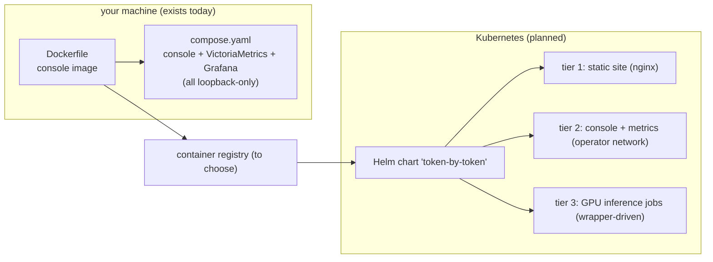

# Deploying Token by Token — what, why, and how (plan)

Status: plan (not implemented). Date: 2026-10-09. Revised 2026-10-09:
rewritten as a step-by-step guide — plain what/why/how first, detail
after. Covers the Docker image, the local compose stack, and the
planned Kubernetes/Helm tiers.
This document lives in the public repository by design; it contains no
credentials, internal URLs, or private data.

---

## 1. What, why, and how

### 1.1 What gets deployed

Three things can be deployed, each with its own lifecycle:

| Tier | What it is | Talks to | Cost |
|---|---|---|---|
| Static site | the React build (`dashboard/dist`) — reads only committed JSON | nothing (no APIs, no metrics backends) | free |
| Episode console | local bridge + operator UI on port 8765, loopback only | the OpenAI-compatible endpoints you configure yourself | free (local) |
| Observability | VictoriaMetrics + Grafana, 30-day retention | the console's `/metrics`, optional DCGM | free (local) |

On top of these (all [planned]): a static-site container image, a
container registry, a Helm chart for the cluster tiers, and GPU
inference jobs driven by the episode wrapper (the episode-presets
plan, section 3.2 — this document defines the chart that adapter
targets).

### 1.2 Why

- **The public site must be static.** It "does not contact
  VictoriaMetrics, Grafana, a provider, or the private source
  repository" (Episode 1 README). Deployment is therefore just: build
  the site, put the files where a web server serves them.
- **The console is an operator tool, never a public service.** It is
  already built loopback-only, read-only root filesystem, all Linux
  capabilities dropped (section 2.2).
- **Local compose is the integration test of the cluster design.**
  Same images, same config files, same ports — minus a cluster. If it
  works locally, the Helm chart has a reference to match.
- **The metrics stack is a build tool, not a site dependency.** "Local
  VictoriaMetrics and Grafana are used to validate the source windows
  and produce the allowlisted aggregate document; they are not website
  dependencies" (README).

### 1.3 How (big picture)



Who runs what:

| You are | You run | Cost |
|---|---|---|
| Student / visitor | static site build + local serve (section 5.1) | free |
| Operator | local Docker stack (5.2), then cluster tiers 1–2 | free |
| Cluster operator | `helm install` for tiers 1–2 (5.3, planned) | infra only |

---

## 2. What is already in the repository (all verified)

### 2.1 The console image — `Dockerfile` (exact)

```dockerfile
FROM node:24.9.0-alpine AS dashboard-builder
WORKDIR /build/dashboard
COPY dashboard/package.json dashboard/package-lock.json ./
RUN npm ci --ignore-scripts
COPY dashboard/ ./
COPY fixtures/episode1/public-aggregate.fixture.json /build/fixtures/episode1/public-aggregate.fixture.json
COPY fixtures/episode1/episode1-planning.json /build/fixtures/episode1/episode1-planning.json
RUN npm run build

FROM python:3.12.12-slim AS runtime
WORKDIR /app
RUN useradd --create-home --uid 10001 inference-lab
COPY --chown=inference-lab:inference-lab src/ ./src/
COPY --chown=inference-lab:inference-lab scripts/episode1_playground.py ./scripts/episode1_playground.py
COPY --chown=inference-lab:inference-lab dashboard/src/data/episode-tests.v1.json ./dashboard/src/data/episode-tests.v1.json
COPY --from=dashboard-builder --chown=inference-lab:inference-lab /build/dashboard/dist ./dashboard/dist
USER inference-lab
ENV PYTHONPATH=/app/src PYTHONUNBUFFERED=1
EXPOSE 8765
HEALTHCHECK --interval=15s --timeout=3s --start-period=5s --retries=5 CMD ["python", "-c", "import urllib.request; urllib.request.urlopen('http://127.0.0.1:8765/healthz', timeout=2)"]
ENTRYPOINT ["python", "/app/scripts/episode1_playground.py"]
CMD ["serve", "--host", "0.0.0.0", "--port", "8765", "--profiles", "/config/profiles.json", "--dashboard-dir", "/app/dashboard/dist"]
```

Line by line, in plain language:

| Part | What it does | Why |
|---|---|---|
| stage 1: `node:24.9.0-alpine` | installs the locked npm dependencies and runs `npm run build` (tsc + vite) | the site is a static build; node is only needed to make it |
| the two `COPY fixtures/...` lines | copy the public Episode 1 fixtures into the build | the dashboard build references them |
| stage 2: `python:3.12.12-slim` | runtime for the bridge (`episode1_playground.py`) | small base image; only the bridge code + the built site ship |
| `useradd ... uid 10001` + `USER inference-lab` | the container never runs as root | standard container hardening |
| `EXPOSE 8765` + `HEALTHCHECK` | the bridge listens on 8765; the health probe hits `/healthz` | orchestrators (Docker, k8s) can tell "up" from "not up" |
| `ENTRYPOINT` + `CMD` | default command: `serve` with profiles read from `/config/profiles.json` | **profiles are a volume, never baked into the image** — no secrets in the image |

### 2.2 The local stack — `compose.yaml` (exact)

```yaml
name: inference-lab
services:
  episode-console:
    build:
      context: .
      dockerfile: Dockerfile
    image: inference-lab-episode-console:local
    command: ["serve", "--host", "0.0.0.0", "--port", "8765", "--profiles", "/config/profiles.json", "--dashboard-dir", "/app/dashboard/dist"]
    ports:
      - "127.0.0.1:8765:8765"
    volumes:
      - "${EPISODE_PROFILES_FILE:-./examples/episode-run-profiles.example.json}:/config/profiles.json:ro"
    environment:
      VLLM_API_KEY: "${VLLM_API_KEY:-}"
      SGLANG_API_KEY: "${SGLANG_API_KEY:-}"
    read_only: true
    tmpfs:
      - /tmp:size=64m,mode=1777
    security_opt:
      - no-new-privileges:true
    cap_drop:
      - ALL
    healthcheck:
      test: ["CMD", "python", "-c", "import urllib.request; urllib.request.urlopen('http://127.0.0.1:8765/healthz', timeout=2)"]
      interval: 10s
      timeout: 3s
      retries: 10
    restart: unless-stopped
    deploy:
      resources:
        limits:
          cpus: "2.0"
          memory: 1g

  victoria-metrics:
    image: victoriametrics/victoria-metrics:v1.151.0
    command:
      - -storageDataPath=/victoria-metrics-data
      - -retentionPeriod=30d
      - -promscrape.config=/etc/victoria-metrics/scrape.yml
    ports:
      - "127.0.0.1:8428:8428"
    volumes:
      - victoria-metrics-data:/victoria-metrics-data
      - ./deploy/victoria-metrics/scrape.yml:/etc/victoria-metrics/scrape.yml:ro
      - ${DCGM_TARGETS_FILE:-./deploy/victoria-metrics/dcgm-targets.empty.yml}:/etc/victoria-metrics/dcgm-targets.yml:ro
    depends_on:
      episode-console:
        condition: service_healthy
    security_opt:
      - no-new-privileges:true
    restart: unless-stopped
    deploy:
      resources:
        limits:
          cpus: "1.0"
          memory: 1g

  grafana:
    image: grafana/grafana:12.2.0
    ports:
      - "127.0.0.1:3000:3000"
    environment:
      GF_AUTH_ANONYMOUS_ENABLED: "true"
      GF_AUTH_ANONYMOUS_ORG_ROLE: Viewer
      GF_AUTH_DISABLE_LOGIN_FORM: "true"
      GF_USERS_ALLOW_SIGN_UP: "false"
      GF_USERS_DEFAULT_THEME: dark
      GF_SECURITY_DISABLE_INITIAL_ADMIN_CREATION: "true"
      GF_ANALYTICS_REPORTING_ENABLED: "false"
      GF_ANALYTICS_CHECK_FOR_UPDATES: "false"
      GF_PLUGINS_CHECK_FOR_UPDATES: "false"
      GF_PLUGINS_PREINSTALL_DISABLED: "true"
      GF_SERVER_ROOT_URL: http://127.0.0.1:3000
    volumes:
      - ./deploy/grafana/provisioning:/etc/grafana/provisioning:ro
      - ./deploy/grafana/dashboards:/var/lib/grafana/dashboards:ro
    read_only: true
    tmpfs:
      - /var/lib/grafana:size=128m,uid=472,gid=0,mode=0750
      - /tmp:size=64m,uid=472,gid=0,mode=1777
    depends_on:
      victoria-metrics:
        condition: service_started
    security_opt:
      - no-new-privileges:true
    cap_drop:
      - ALL
    healthcheck:
      test: ["CMD-SHELL", "wget -qO- http://127.0.0.1:3000/api/health | grep -q '\"database\": \"ok\"'"]
      interval: 10s
      timeout: 3s
      retries: 12
    restart: unless-stopped
    deploy:
      resources:
        limits:
          cpus: "1.0"
          memory: 512m

volumes:
  victoria-metrics-data:
```

The hardening knobs, in plain language:

| Knob | Value in compose.yaml | What it means |
|---|---|---|
| loopback-only ports | `127.0.0.1:8765`, `127.0.0.1:8428`, `127.0.0.1:3000` | nothing is reachable from the network |
| profiles volume | `${EPISODE_PROFILES_FILE:-./examples/episode-run-profiles.example.json}` mounted `:ro` | endpoint config comes from a file you control; the example file is the default |
| `read_only: true` + `tmpfs` | console + grafana | the filesystem cannot be modified at runtime; scratch space is bounded |
| `cap_drop: ALL` + `no-new-privileges` | all three services | no Linux capabilities, no privilege escalation |
| resource limits | console 2 CPU / 1 GiB, VM 1 CPU / 1 GiB, grafana 1 CPU / 512 MiB | the local stack cannot eat the machine |
| healthchecks + `depends_on` | console `/healthz`, grafana `/api/health` | startup order: console healthy → VM started → grafana up |
| Grafana anonymous **Viewer** | login form disabled, sign-up disabled, initial-admin creation disabled | read-only dashboards, no accounts possible |

Facts: VictoriaMetrics v1.151.0 with 30-day retention and a 5-second
scrape (section 2.3); Grafana 12.2.0 with the datasource and dashboard
provisioned from `deploy/grafana/`. Note: `compose.yaml` is committed
but is not yet part of the README quickstart — section 5.2 documents
it.

### 2.3 Observability configs (exact)

`deploy/victoria-metrics/scrape.yml` (full file):

```yaml
global:
  scrape_interval: 5s
scrape_configs:
  - job_name: inference-lab-episode-console
    static_configs:
      - targets: ["episode-console:8765"]
    metrics_path: /metrics
  - job_name: dcgm-exporter
    file_sd_configs:
      - files: ["/etc/victoria-metrics/dcgm-targets.yml"]
```

- `episode-console:8765` — the compose service name; the bridge
  exposes Prometheus metrics at `/metrics`.
- DCGM targets use **file-based discovery**: the default is
  `dcgm-targets.empty.yml` (no GPU targets). When a GPU host's DCGM
  exporter is available, set
  `DCGM_TARGETS_FILE=deploy/victoria-metrics/dcgm-targets.example.yml`.

Grafana is provisioned from `deploy/grafana/provisioning/` (datasource:
VictoriaMetrics; dashboard: `inference-lab-execution.json`), so nothing
is clicked into existence by hand.

### 2.4 Dashboard build scripts (exact, `dashboard/package.json`)

```json
"build": "tsc -b && vite build",
"check": "tsc -b --pretty false",
"dev": "vite --host 127.0.0.1"
```

Build-time public flag: the site shows a Live dashboard link **only**
when `VITE_PUBLIC_GRAFANA_ENABLED=true` is set **at build time**; the
link then points at the public base URL `https://graph.endlesstokens.ai`
with no UID, credentials, or query parameters — "Leave it disabled
until the owner verifies public, read-only access" (README). That
build flag is exactly what the planned site image (section 3) packages
as a Docker build arg.

---

## 3. Planned: the static-site image

The site is already 100% static — `dashboard/dist/` plus committed
JSON. The image adds no behavior, only packaging:

```dockerfile
# Dockerfile.site   # PLANNED — builder mirrors stage 1 of Dockerfile
FROM node:24.9.0-alpine AS builder
WORKDIR /build/dashboard
ARG VITE_PUBLIC_GRAFANA_ENABLED=false
ENV VITE_PUBLIC_GRAFANA_ENABLED=$VITE_PUBLIC_GRAFANA_ENABLED
COPY dashboard/package.json dashboard/package-lock.json ./
RUN npm ci --ignore-scripts
COPY dashboard/ ./
COPY fixtures/episode1/public-aggregate.fixture.json /build/fixtures/episode1/public-aggregate.fixture.json
COPY fixtures/episode1/episode1-planning.json /build/fixtures/episode1/episode1-planning.json
RUN npm run build

FROM nginx:1.27-alpine
COPY --from=builder /build/dashboard/dist /usr/share/nginx/html
USER nginx
EXPOSE 80
```

Build args:

| Arg | Default | Meaning |
|---|---|---|
| `VITE_PUBLIC_GRAFANA_ENABLED` | `false` | bakes the Live-dashboard-link decision into the static bundle (README) |

Multi-arch build [planned]:

```bash
docker buildx build --platform linux/amd64,linux/arm64 -f Dockerfile.site \
  --build-arg VITE_PUBLIC_GRAFANA_ENABLED=false \
  -t <registry>/token-by-token-site:<tag> --push .
```

---

## 4. Planned: Kubernetes and Helm

### 4.1 Tiers

| Tier | Workload | Network exposure |
|---|---|---|
| 1 | static site (nginx) | public (ingress + TLS) |
| 2 | console + VictoriaMetrics + Grafana | operator network only (no public ingress) |
| 3 | GPU inference jobs (vLLM/SGLang pods) | internal; driven by the episode wrapper |

The two properties that matter: the public site has **no runtime
dependencies** (tier 1 is just files), and tier 2 is **never public**
(same loopback-only posture as compose, expressed as network policies
+ no ingress).

### 4.2 Chart layout

```text
deploy/helm/token-by-token/
├── Chart.yaml
├── values.yaml
├── values.cluster.example.yaml
└── templates/
    ├── _helpers.tpl
    ├── site/            # deployment, service, ingress (tier 1)
    ├── console/         # deployment, service (tier 2)
    ├── metrics/         # victoria-metrics, grafana, scrape (tier 2)
    └── gpu/             # future: job templates for tier 3
```

### 4.3 `values.yaml` [planned]

```yaml
# PLANNED
global:
  imageRegistry: ""            # e.g. ghcr.io/<owner>
  imagePullSecrets: []
  imageTag: ""                 # shared tag unless a section overrides

staticSite:
  enabled: true
  image: token-by-token-site
  replicas: 2
  service:
    port: 80
  ingress:
    enabled: true
    host: ""                   # public domain — open question
    tls: true                  # cert-manager issued

console:
  enabled: true
  replicas: 1                  # sticky local state; scale before exposing
  profiles:
    secretName: episode-console-profiles   # mounted at /config/profiles.json
  resources: {cpu: "2", memory: 1Gi}

metrics:
  enabled: true
  retention: 30d
  scrapes: [episode-console]
  dcgmTargets: ""              # file content, empty by default (mirrors compose)
  grafana:
    anonymousViewer: true

domain:
  public: ""                   # tier 1 host — open question
```

### 4.4 Static-site workload (tier 1)

Plain: a Deployment (2 replicas, non-root nginx) + a Service (port 80)
+ an Ingress with TLS. The only public surface in the whole deployment.

```yaml
# PLANNED — condensed
apiVersion: apps/v1
kind: Deployment
metadata:
  name: site
spec:
  replicas: 2
  template:
    spec:
      containers:
        - name: site
          image: <registry>/token-by-token-site:<tag>
          ports:
            - containerPort: 80
          securityContext:
            runAsNonRoot: true
          readinessProbe:
            httpGet: {path: /, port: 80}
```

(The Ingress + cert-manager TLS block follows the same pattern; the
host is the open question in section 7.)

### 4.5 Console workload (tier 2)

Same image as local compose. Environment mapping, exact:

| compose.yaml | Helm equivalent |
|---|---|
| `--profiles /config/profiles.json` (volume) | Secret `episode-console-profiles`, mounted read-only |
| `VLLM_API_KEY` / `SGLANG_API_KEY` env | Secret keys (empty unless the operator sets them) |
| `read_only: true`, `tmpfs`, `cap_drop: ALL`, `no-new-privileges` | `readonlyRootFilesystem: true`, emptyDir tmpfs, `securityContext` |
| healthcheck `/healthz` | `livenessProbe` / `readinessProbe` on `/healthz` |
| resource limits | `resources.limits` 2 CPU / 1 GiB |

### 4.6 Metrics workload (tier 2)

Same images and config as compose: VictoriaMetrics v1.151.0, 30-day
retention, the committed `scrape.yml` job; Grafana 12.2.0, anonymous
Viewer. The DCGM file-sd target stays empty by default; tier 3 will
fill it from the GPU pool.

### 4.7 Secrets and TLS [planned]

| Item | Mechanism |
|---|---|
| endpoint profiles (console) | k8s Secret, mounted read-only |
| optional API keys | k8s Secret keys, empty by default |
| site TLS | cert-manager + cluster issuer (public domain: open question) |
| image pulls | `imagePullSecrets` per registry (open question) |

### 4.8 Future GPU inference jobs (tier 3)

Not defined here beyond the interface: the episode wrapper
(`2026-10-09-agentbench-episode-presets-plan.md` section 3.2)
provisions an ephemeral GPU job/pod per episode, renders the engine
launch from the preset, attests, benchmarks, and deletes. The
chart's `gpu/` templates and the DCGM targets file are its landing
zone.

---

## 5. Running it, step by step

### 5.1 Free, no Docker required (student)

Build and serve the site locally:

```bash
npm --prefix dashboard ci
npm --prefix dashboard run check
npm --prefix dashboard run build
npm --prefix dashboard run dev -- --host 127.0.0.1 --port 5173 --strictPort
```

Open `http://127.0.0.1:5173/`. To serve the **production build**
instead, any static file server works, e.g.:

```bash
python3 -m http.server 8080 --directory dashboard/dist --bind 127.0.0.1
```

### 5.2 Local Docker stack (operator)

`compose.yaml` is committed but not yet part of the README quickstart;
this section documents it. From the repository root:

```bash
docker compose up --build
docker compose ps        # wait until episode-console and grafana are "healthy"
```

Then, from the same machine:

- console: `http://127.0.0.1:8765/` (bridge + dashboard)
- metrics UI: `http://127.0.0.1:3000/` (anonymous Viewer)
- VictoriaMetrics API: `http://127.0.0.1:8428/`

To point the console at real endpoints, set
`EPISODE_PROFILES_FILE=/path/to/profiles.json` before `up` (format:
`examples/episode-run-profiles.example.json`).

### 5.3 Cluster [planned]

```bash
# after registry + domain are decided (section 7)
helm upgrade --install token-by-token deploy/helm/token-by-token \
  -f deploy/helm/token-by-token/values.cluster.example.yaml
kubectl -n token-by-token get deploy,svc,ingress
```

## 6. Verification and operations

Local (exists today, exact — README "Static publication lifecycle"):

```bash
python3 -m unittest tests.test_static_evidence_pipeline tests.test_episode1_public_evidence tests.test_publication_privacy
python3 scripts/check_publication_privacy.py --root .
npm --prefix dashboard run build
python3 scripts/check_publication_privacy.py --root dashboard/dist --files-only
node tests/dashboard_offline_acceptance.cjs dashboard/dist
```

Fourteen node acceptance/contract tests exist in `tests/` (e.g.
`dashboard_offline_acceptance.cjs`, `dashboard_site_v2_acceptance.cjs`);
the site-v2 one runs against a dev server:

```bash
npm --prefix dashboard run dev -- --port 4173
node tests/dashboard_site_v2_acceptance.cjs http://127.0.0.1:4173/
```

Cluster checks [planned]: `kubectl rollout status` + probe status per
workload; `helm get values` for the effective config. Rollback:
`helm rollback token-by-token`. Cost-stop rule: if an unexpected charge
appears, `helm uninstall token-by-token` + delete the namespace, then
verify deletion in the registry/provider dashboard (same discipline as
the paid-episode rule in the README).

## 7. Open questions

- **Registry**: which registry hosts the images (GHCR vs other), and
  what `imagePullSecrets` does the cluster need?
- **Public domain(s)**: what public host(s) do the static site (and
  eventually the public Grafana base URL) use?
- **Ingress + TLS**: which ingress controller and cert-manager setup?
- **Console exposure**: loopback only (default), or an operator VPN /
  authenticated ingress? If exposed, add auth in front.
- **Storage**: which StorageClass and PVC size for VictoriaMetrics
  (30-day retention)?