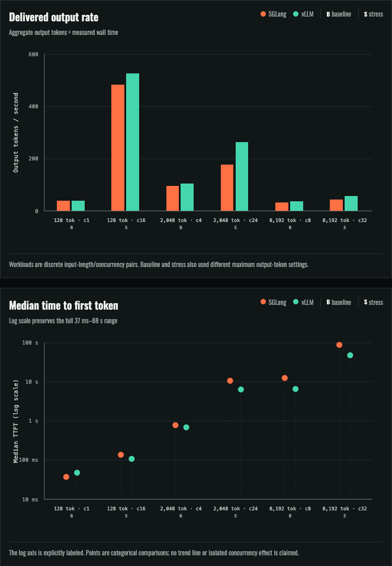
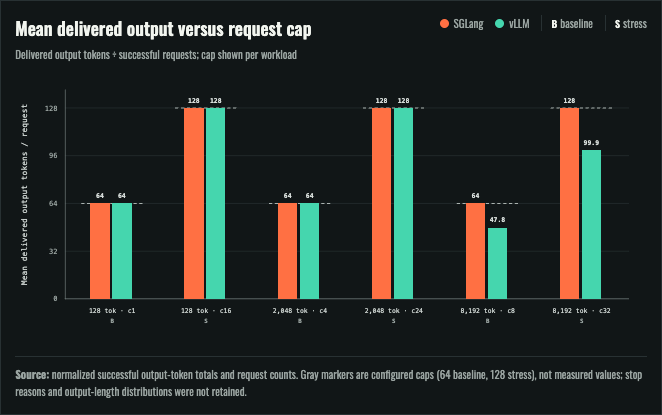
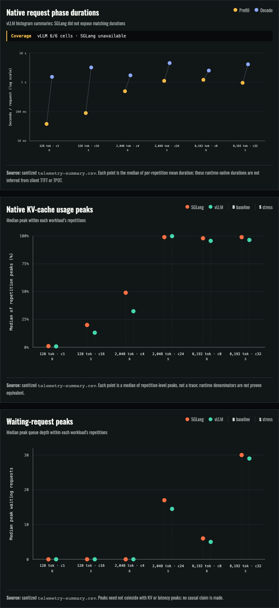
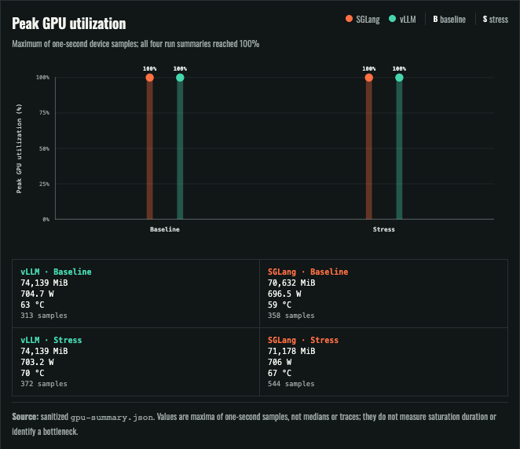

# Episode 0 — Warm-up: vLLM and SGLang on one H100

Episode 0 establishes the series' measurement foundation with one narrow
question: under the recorded synthetic closed-loop workload, how did vLLM
0.29.0 and SGLang 0.5.20 behave while serving
Qwen/Qwen2.5-32B-Instruct on one recorded NVIDIA H100 80GB HBM3 per run?

This is exploratory historical evidence. It is not a production-capacity
result, an equal-output comparison in every cell, or a universal runtime
ranking. No winner is claimed. The study identifies measurement problems that
later episodes should fix before making a selection.

## What was recorded

Both runtime arms used BF16, a 16,384-token context, prefix caching, chunked
prefill, and the same pinned model revision. The study covered six
input/concurrency cells with two or three repetitions per cell. The sanitized
snapshot reports 936 successful requests and zero recorded failures; success
means a completed valid stream, not semantic quality or production reliability.

At the 8,192-input-token, concurrency-32 stress cell:

| Metric | vLLM | SGLang |
|---|---:|---:|
| Delivered output rate | 57.5 tok/s | 43.7 tok/s |
| Median TTFT | 47.9 s | 88.3 s |
| Mean delivered output | 99.89 tokens/request | 128.00 tokens/request |
| Configured output cap | 128 tokens/request | 128 tokens/request |

The rates are observed delivered throughput, but the runtimes did unequal work.
Stop reasons and output-length distributions were not retained, so the evidence
does not explain the difference or establish equal-output efficiency.

Read the canonical [results](../../docs/results.md),
[metric definitions](../../docs/metric-definitions.md), and
[cost evidence](../../docs/cost-evidence.md) for the complete record.

## Read the dashboard

*Performance overview.* Grouped bars report aggregate delivered output tokens
per second; points report TTFT p50. Input length and concurrency change together
across the labeled cells, so the chart is a workload map rather than a
single-variable sweep.

*Delivered work check.* The same output-token cap did not produce the same
amount of output. This prevents treating the long-context throughput pairs as
controlled equal-work comparisons.

*Runtime-native telemetry.* Phase values summarize repetition means, while KV
cache and queue values summarize repetition peaks. Metric surfaces and native
occupancy denominators are not proven comparable across runtimes.

*GPU peaks.* Both runtimes reached 100% sampled utilization. The panels show
maxima from one-second samples, not sustained averages, simultaneous peaks, or
causal attribution.

## Explore it locally

The repository supports three distinct workflows:

1. Rebuild a zero-cost fixture bundle from the included sanitized aggregates.
2. Verify and inspect the checksum-bound historical snapshot.
3. Prepare a fresh paid measurement under a newly approved digest-bound plan.

Follow the root README's [copyable zero-cost quickstart](../../README.md#start-here)
for the canonical prerequisite checks, fixture rehearsal, expected output, and
loopback-only dashboard command. The included results need no GPU or provider
account. The dashboard opens on the [episode index](http://127.0.0.1:5173/#episodes);
choose Episode 0 or open [its study view](http://127.0.0.1:5173/#episode-0).
**Open local results** (`#local-results`) accepts a normalized benchmark JSON
and optional matching runtime summary; files remain in the browser and are not
uploaded.

For a new measurement, follow the canonical [Runpod setup and GPU selection](../../docs/runpod-setup.md),
[live-run procedure](../../docs/live-run.md), and
[execution-plan authoring guide](../../docs/execution-plan-authoring.md). The
historical images and Runpod template IDs are unknown. A future run therefore
needs newly resolved immutable images, its own approved plan and maximum charge,
and verified permanent deletion of every created resource.

## Cost and limits

The two retained H100 runs recorded an approximately **$2.19 combined
conservative CLI debit**. Per-run and per-runtime allocation is unavailable,
and the retained balance summaries are not an invoice. The local fixture and
dashboard incur **$0 in provider charges**. See the
[cost evidence ledger](../../docs/cost-evidence.md) for the separate earlier
RTX PRO 6000 trial and the full accounting boundary.

The historical teardown record says both H100 pods were deleted and absent,
including direct lookups returning not found. That is historical evidence, not
a current provider-side recheck.

Other material limits include missing immutable runtime image digests,
machine/topology identity, tokenizer digest, exact harness commit, arm order,
raw repetitions, stop reasons, and output-length distributions. Tail statistics
are descriptive: the stress run has only two independent repetitions, no
uncertainty estimate, and no predeclared SLO goodput. The next experiments belong
in the canonical [series roadmap](../../docs/roadmap.md).

[Back to the series index](../../README.md)
